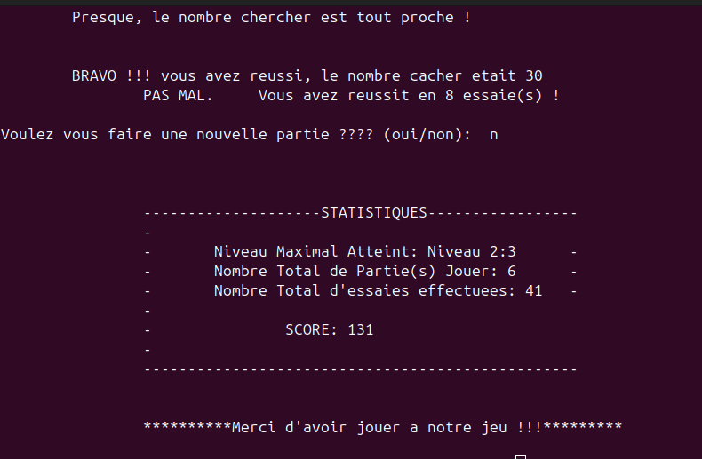

# Game Guess

simple game to guess the hidden number in a given intervall  

## Previews

## Earned concept

- Compilation d'un proramme en C (*Monsieur*: **gcc**)
- Lecture des données au clavier et premiers pas dans l'affichage des messages (**printf** et **scanf**)
- Declariation des variables et des constantes: **int**, **float**, **char**...
- utilisation des opérateurs aritmétiques et loique en C (**+, -, *, /, &&, ||**)
- utilisation des structures conditionnelles simpples et complete (**if, if_else, switch**) et des structures conditionnelles complexes (**do...while, for..., while...**)
- declarations et utilisation des fonctions (pour **l'affichage des statistiques**, **les calculs**...)
- introduction du concept de **prorammation modulaire** et utilisation pour refactoriser mon code
- petite manipulation des **tableaux** et des **chaines de caractères**
- découvertes et utilisation des bibliotèques tierces comme **stdlib.h, string.h, time.h, math.h**
- **Autodidactie** et Culture de la **persévérence** :-)

### Difficulties

*--* Determiner le type d'une variable.;
*--* Faire la comparaison entre deux chaines de caractere;
*--* Definir une fonction qui genere un nombre aleatoire
*--* Definir une fonction qui genere un nombre minimal et un nombre maximal
*--* Definir une fonction qui choisit un nombre aleatoire compris entre deux nombres
*--* Definir une fonction qui donne un score en fonction du nombre de paries jouer et du nombre d'essaies
*--* Gerer les conditions et les contraintes comme un pro :-)

### Author

Written by: [**Bartez Kenwou**](https://github.com/01Barthez)
info L1
written in: 2022
update in: 2024
